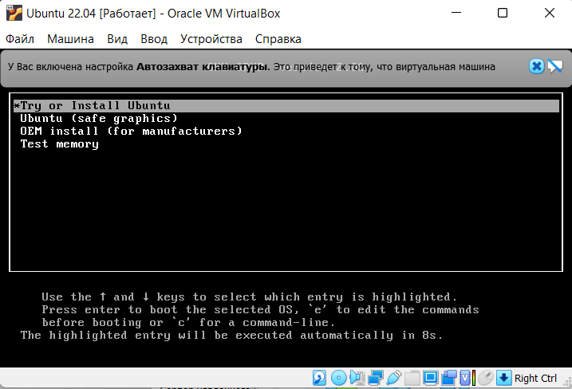

                       РОССИЙСКИЙ УНИВЕРСИТЕТ ДРУЖБЫ НАРОДОВ

               Факультет физико-математических и естественных наук

               Кафедра прикладной информатики и теории вероятностей

                                      ОТЧЕТ

                            ПО ЛАБОРАТОРНОЙ РАБОТЕ №1

                          дисциплина:Операционные системы		 

                                        Студент: 
                                        Куликова Юлия Викторовна                                 

                                        Группа: НПМбв-01-18                                      

                                      МОСКВА

                                      2022 г.

**Цель работы:**

Целью данной работы является приобретение практических навыков установки
операционной системы на виртуальную машину, настройки минимально
необходимых для дальнейшей работы.

**Задание:**

1\) Запустим программу для виртуальных машин VirtualBox и создадим одну
виртуальную машину для Linux Ubuntu 22.04

2\) Укажем объём оперативной памяти

3\) Создаём новый виртуальный жёсткий диск

4\) Укажем тип VDI

5\) Формат хранения динамический виртуальный жёсткий диск

6\) Размер жёсткого диска 10гб (вполне достаточно)

7\) Запускаем виртуальную
машину

8\) Выбираем загрузочный диск

9\) Нажимаем первый пункт

10\) Нажимаем Install Ubuntu

11\) Выбираем раскладку клавиатуры
12)

12\) Сделаем установку со всеми доступными приложениями и утилитами

13\) Выбираем часовой пояс

14\) Создаём учётку

15\) После установки и перезагрузки ОС готова к работе.

**Выводы:**

В ходе выполнения лабораторной работы были приобретены навыки по
администрированию и взаимодействию с операционной системой Linux Ubuntu
и программой VirtualBox. Были выполнены минимально необходимые настройки
операционной системы и программы для виртуализации операционной системы.

**Ответы на контрольные вопросы:**

1\) Учётная запись в операционной системе Linux содержит в себе
следующие сведения:

-   Системное имя (username)

-   Идентификатор пользователя (UID -- User ID)

-   Идентификатор группы (GID -- Group ID)

-   Полное имя (full name)

-   Домашний каталог (home directory)

-   Начальная оболочка (login shell)

2\) Укажите команды терминала и приведите примеры:

-   Для получения справки по команде %name% нужно ввести: %name% \--help
    -- например команда ls --help для получения справки команды ls;

-   Команда cd %name% предназначается для перемещения по файлам и
    каталогам, например cd Desktop или cd /usr/share;

-   Команда rm %name% предназначается для удаления файла, например rm
    hello; Команда rmdir %name% предназначается для удаления каталога,
    например rmdir hello\_dir; Команда mkdir %name% предназначается для
    создания каталога, например mkdir hello\_dir; Команда touch %name%
    предназначается для создания файла, touch file;

-   Команда chmod %name% предназначается для задания определённых прав
    на файл или каталог, например chmod u+x file или chmod 766 file;

-   Команда history %опции% %файл% предназначается для задания
    определённых прав на файл или каталог, например history -c или
    history 100;

3\) Что такое файловая система? Приведите примеры с краткой
характеристикой.

Ответ: Систематизированное хранение цифровых данных по различным
свойствам.

  Файловая система   ОС                       Длина имени файла
  ------------------ ------------------------ --------------------------------
  FAT16              MS-DOS, Windows 95       8 символов латинского алфавита
  VFAT, FAT32        Windows 95, Windows 98   255 символов

4\) Как посмотреть, какие файловые системы подмонтированны в ОС?

Ответ: для того, чтобы узнать какие файловые системы в данный момент
времени подмонтированны в ОС, нужно выполнить команду: findmnt -all;

5\) Как удалить зависший процесс?

Ответ: удалить зависший процесс, можно с помощью команды: kill %-сигнал%
%-pid\_процесса%, чтобы узнать PID, выполним команду: ps aux \| grep
%name-of-process%;
