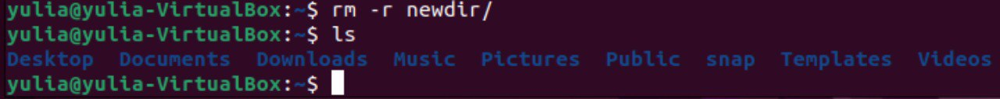

                           РОССИЙСКИЙ УНИВЕРСИТЕТ ДРУЖБЫ НАРОДОВ

                   Факультет физико-математических и естественных наук

                   Кафедра прикладной информатики и теории вероятностей

                                          ОТЧЕТ

                                ПО ЛАБОРАТОРНОЙ РАБОТЕ №5 	

                              дисциплина:Операционные системы		 

                                            Студент: Куликова Юлия Викторовна                                  

                                            Группа: НПМбв-01-18                                      

                                          МОСКВА

                                          2022 г.

# Цель работы
Приобретение практических навыков взаимодействия пользователя с системой
посредством командной строки.

# Задания
1) Определите полное имя вашего домашнего каталога. Далее относительно этого
каталога будут выполняться последующие упражнения.

2) Выполните следующие действия:
        
* Перейдите в каталог /tmp.

* Выведите на экран содержимое каталога /tmp. Для этого используйте команду ls с различными опциями. Поясните разницу в выводимой на экран
информации. Ответ: ls -a  - Вывести список всех файлов (без этой опции не выводятся скрытые файлы, имена которых начинаются с точки). ls -l  - Вывод в длинном формате: перед именами файлов выдается режим доступа, количество ссылок на файл, имена владельца и группы, размер в байтах и время последней модификации. Если файл является специальным, то в поле размера выводится старший и младший номера устройства.

* Определите, есть ли в каталоге /var/spool подкаталог с именем cron?

* Перейдите в Ваш домашний каталог и выведите на экран его содержимое.
Определите, кто является владельцем файлов и подкаталогов?
Ответ: Владельцем является yulia.

1) Выполните следующие действия:
* В домашнем каталоге создайте новый каталог с именем newdir.

* В каталоге ~/newdir создайте новый каталог с именем morefun

* В домашнем каталоге создайте одной командой три новых каталога с именами letters, memos, misk. Затем удалите эти каталоги одной командой.

* Попробуйте удалить ранее созданный каталог ~/newdir командой rm. Проверьте, был ли каталог удалён.

* Удалите каталог ~/newdir/morefun из домашнего каталога. Проверьте,
был ли каталог удалён.

4) С помощью команды man определите, какую опцию команды ls нужно использовать для просмотра содержимое не только указанного каталога, но и подкаталогов, входящих в него.

5) С помощью команды man определите набор опций команды ls, позволяющий от-
сортировать по времени последнего изменения выводимый список содержимого
каталога с развёрнутым описанием файлов.

6) Используйте команду man для просмотра описания следующих команд: cd, pwd,
mkdir, rmdir, rm. Поясните основные опции этих команд.

7) Используя информацию, полученную при помощи команды history, выполните
модификацию и исполнение нескольких команд из буфера команд.

# Вывод
В ходе выполнения лабораторной работы №5 были приобретены навыки по взаимодействию с каталогами, файлами и командной строкой.

# Контрольные вопросы
1) Командная строка - программа, которая служит промежуточным слоем между человеком и машиной и передаёт друг другу команды и ответы машине и человеку соотвественно.
2) Используется команда pwd - print working directory.
3) При помощи команды ls (-опции) / tree(-опции)
4) Скрытые файлы - файлы, которые нежелательны для просмотра, редактирования и перемещения имют впереди названия точку, чтобы вести имна скрытых файлов используют ls -a.
5) Команда rm для удаления файла, для удаления папки rmdir.
6) Используя команду history.
7) Используя команду history, запомнить номер команды, потом написать ошибку и её замену.
8) Для таких случаев используется символ ;
9) Символ экранирования нужен для того, чтобы командная строка не приняла специальные символы ., *, ... за команду.
10) ls -l показывает дополнительную информацию о файле - дата изменения, права доступа,список владельцев.
11) Относительный путь- путь к файлу, к которому не нужно задавать полное местонахождение, а можно обойтись быстым вводом - text.txt, при этом файла и терминала должны быть открыто из одного каталога или указать путь  order/text.txt
12) Команда  help
13) Вводим первые буквы, нажимаем клавишу Tab.